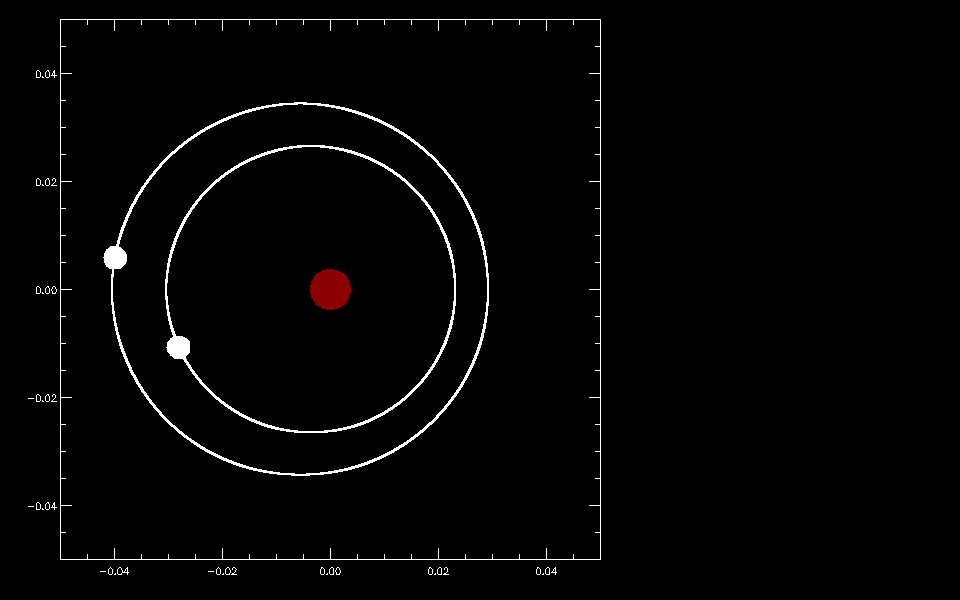

## The multi-planet system K2-146

K2-146 is a M3.0V star hosting 2 mini-Neptunes. The inner and outer planets have orbital periods of around 2.6 days and 4.0 days respectively, showing a near 3:2 period commensurability.

If you want to read more about the analysis of this system, a submitted version of my paper is available on arXiv via this [link](https://arxiv.org/abs/1907.11141).
An independent paper on the characterisation of this system by A. Hamann's team is also available via this [link](https://arxiv.org/abs/1907.10620).

Below is an animation showing the orbits of K2-146 b and c.

